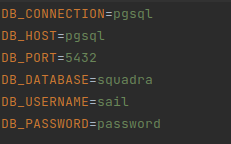

<p align="center"><a href="https://laravel.com" target="_blank"></a></p>

<p align="center">
<a href="https://travis-ci.org/laravel/framework"></a>
<a href="https://packagist.org/packages/laravel/framework"></a>
<a href="https://packagist.org/packages/laravel/framework"></a>
<a href="https://packagist.org/packages/laravel/framework"></a>
</p>

## Desafio

<p>Construiremos unicamente uma aplicação backend de cadastro de endereços. Trabalharemos com cadastro de UF, MUNICÍPIO, BAIRRO e PESSOA. Iremos permitir o cadastro de vários endereços para uma pessoa.

Para facilitar, deixamos o script de criação de banco, solicitamos que usem Postgresql. 
Teremos as tabelas de UF (tb_uf), Município (tb_municipio), Bairro (tb_bairro), Endereço (tb_endereco) e Pessoa (tb_pessoa), lembrando que o cadastro na tabela de endereços será feito no endpoint de pessoa. 

GET - obrigatório<br>
POST - obrigatório<br>
PUT - obrigatório<br>
DELETE - opcional:

    Pode fazer apenas alterando um status de 1 (ativo) para 2 (inativo)
    Pode fazer deletando um registro, mas neste caso precisa ser com deleção em cascata, por exemplo: Ao excluir um Município, excluir também os bairros, desde que não tenha alguma pessoa com endereço que esteja vinculado ao Município.


Todas as respostas deverão retornar status 200 se deu certo e um status diferente de 200 se algo deu errado.
As mensagens de erro devem vir sempre em português.

O projeto deverá ser desenvolvido com Laravel, utilizando principalmente os seguintes itens do framework:

    Eloquent ORM (https://laravel.com/docs/9.x/eloquent)
    Validação dos dados da Requisição (https://laravel.com/docs/9.x/validation)
    Tratamento de erros (https://laravel.com/docs/9.x/errors)

Além disso é necessário que a API seja documentada com Swagger (Exemplo: https://blog.quickadminpanel.com/laravel-api-documentation-with-openapiswagger/)</p>


## Feramentas usada e metodo de desenvolvimento 

**laravel sail**


<p>
O Laravel Sail é uma interface de linha de comando leve 
(assim como o artisan) e simples de usar. Seu foco é 
abstrair todo o uso do Docker para que seja mais simples 
durante o dia a dia.</p>

**TDD (Test Driven Development)**
<p>
Todo o projeto foi desenvolvido utilizando TDD, que basicamente é o desenvolvimento orientado a testes 
garantindo assim um codigo mais seguro e com todos os testes necessários. 
</p>

## como instalar o projeto

**Primeiro Clone o projeto**

```
    git clone https://github.com/figmateus/newthinker-desafio.git
```

**Copie o arquivo .env**
```
 cp .env.example .env
 ```

 **Rode os comandos**
```
 composer update
 ./vendor/bin/sail build
 php artisan sail:install
 npm install 
 ./vendor/bin/sail artisan key:generate
 ```

 **Configure o arquivo .env**
    <p align="start"></a></p>

 **Inicie o container**
 ```
 ./vendor/bin/sail up
 ```

**Rode os testes**
 ```
 sail artisan test
 ```
